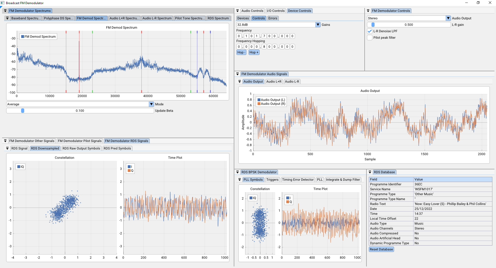
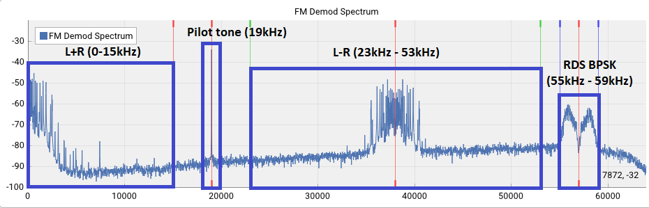

# SDR FM Radio Demodulator
[](https://github.com/FiendChain/FM-Radio/actions/workflows/x86-windows.yml)
[](https://github.com/FiendChain/FM-Radio/actions/workflows/x86-ubuntu.yml)

## Introduction
An implementation of a FM demodulator that supports
- Mono audio using L+R signal
- Stereo audio using L-R signal
- RDS decoding 



As much of the internal state of the demodulator is shown for academic purposes. This program is intended to be an educational tool. 

SIMD is employed to improve DSP performance on x86 processors. 

## Instructions
1. Setup rtlsdr radio drivers according to [here](https://www.rtl-sdr.com/rtl-sdr-quick-start-guide/)
2. Plug in your RTLSDR Blog v3 dongle
3. Download program from releases page.
4. Unzip and extract folder.
5. Run <code>./fm_demod_tuner.exe</code>

## Explanation
FM radio contains many data components which are present after FM demodulation.
| Frequencies | Description |
| --- | --- |
| 0 - 15kHz  | L+R audio |
| 19kHz      | Pilot tone |
| 38 ± 15kHz | L-R audio |
| 57 ± 2kHz  | RDS (radio data system) |



To compensate for frequency and phase offsets due to errors in the receiver or transmitter we need to lock onto the pilot tone. This is done with a PLL.

To downconvert the L-R and RDS signals we use harmonics of the PLL output. The L-R signal is downconverted using the second harmonic, and the RDS signal is downconverted by the third harmonic. In an analogue circuit this can be easily done by squaring the 19kHz PLL output and filtering out the desired harmonics from the square wave.

### Stereo Audio
Stereo audio can be generated by combining the mono L+R audio with the L-R audio.
```c
L = (L+R) + (L-R) = 2L
R = (L+R) - (L-R) = 2R
```

### Radio Data System (RDS)
The RDS signal is a binary phase shift keyed signal. This is passed through a BPSK symbol synchroniser to get constellation points in the range of -1 to 1.

The RDS signal contains the following data described [here](https://en.wikipedia.org/wiki/Radio_Data_System).

The document used to decode the standard (partially) is located [here](docs/EN50067_RDS_Standard.pdf).

It usually contains the programme identifier code and additional descriptive text and metadata.

## Running from offline data
1. Download FM signal recording from [here](https://github.com/FiendChain/FM-Radio/releases/tag/sample_data).
2. Extract <code>*.pcm</code> from archive
3. Download program from releases page
4. Run <code>./fm_demod_no_tuner.exe -i \<recording\>.pcm</code>

## Recompiling for older processors
The release binaries are compiled against AVX2 which should be available on most modern processors. However if your CPU doesn't have these instructions, you may get an ```Illegal Instruction``` error when you run it in the terminal. 

Follow ```./toolchains/*/README.md``` to compile for your CPU.